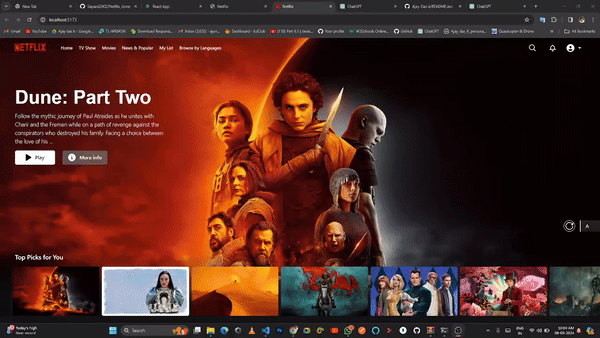

# NetFlix_Clone_Using_React2

"Netflix_Clone_Using_React2" is a project aimed at replicating the user interface and functionality of the popular streaming platform Netflix using the React.js library. This clone project will involve creating components to mimic Netflix's homepage layout, including sections for trending content, recommended shows and movies, user profiles, and search functionality. Additionally, it will implement features such as responsive design to ensure compatibility across various devices, user authentication for account access, and integration with an external API to fetch real-time data for movies and TV shows. The project provides an opportunity for developers to gain hands-on experience with React.js while also honing their skills in UI/UX design, state management, and API integration.



## Getting Started

To get started with the project, follow these steps:

1. Go to the project directory.
2. Install dependencies by running:
   
   ```bash
   npm install --force
3. Run Project by:
   
   ```bash
   npm run dev

   Watch the demo of the project on YouTube:


